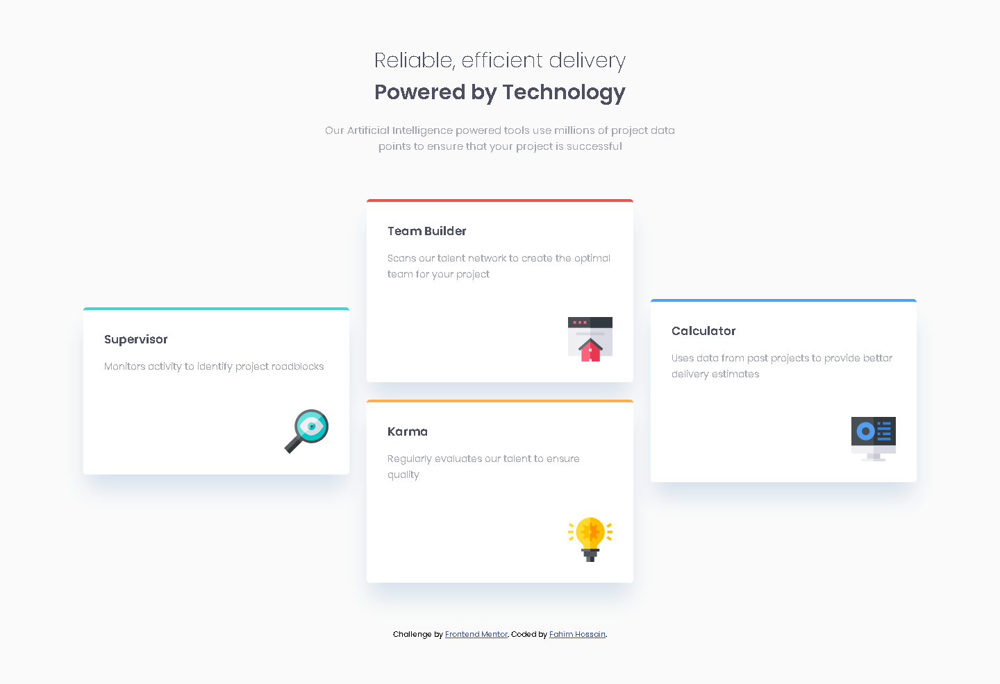
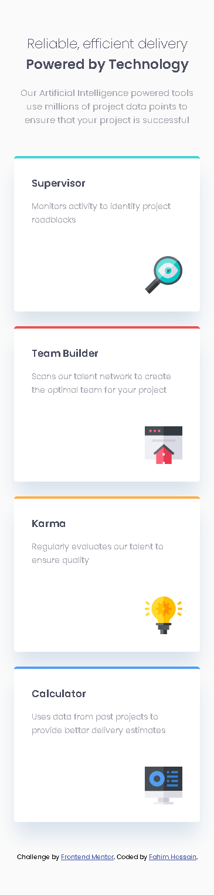

# Frontend Mentor - Four card feature section solution

This is a solution to the [Four card feature section challenge on Frontend Mentor](https://www.frontendmentor.io/challenges/four-card-feature-section-weK1eFYK). Frontend Mentor challenges help you improve your coding skills by building realistic projects.

## Table of contents

- [Overview](#overview)
  - [The challenge](#the-challenge)
  - [The Design](#the-design)
  - [What I Built](#what-i-built)
  - [Screenshot](#screenshot)
  - [Links](#links)
- [My process](#my-process)

  - [Built with](#built-with)

- [Author](#author)

## Overview

### The challenge

Users should be able to:

- View the optimal layout for the site depending on their device's screen size

## The Design

### Desktop design

### Mobile design

## What I Built

### Screenshot

### Desktop Preview

### Mobile Preview

### Links

- Solution URL: [Github](https://github.com/Mr-NotSoCreative/four-card-feature-section)
- Live Site URL: [Add live site URL here](https://your-live-site-url.com)

## My process

### Built with

- Semantic HTML5 markup
- CSS custom properties
- CSS Grid

## Author

- Frontend Mentor - [@Mr-NotSoCreative](https://www.frontendmentor.io/profile/Mr-NotSoCreative)
- Github - [@Mr-NotSoCreative](https://github.com/Mr-NotSoCreative)

